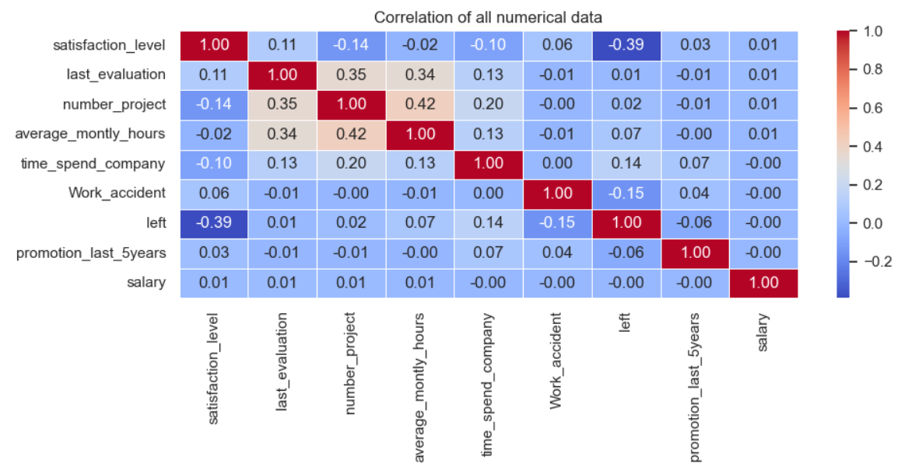
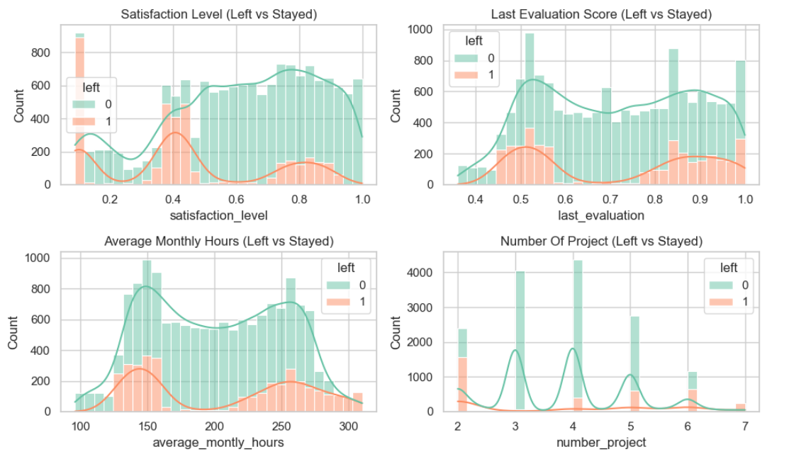
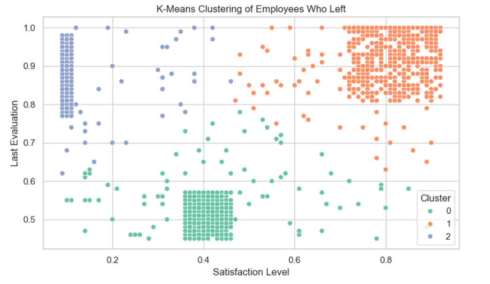
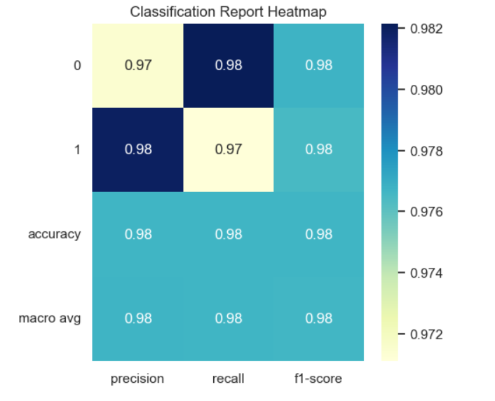
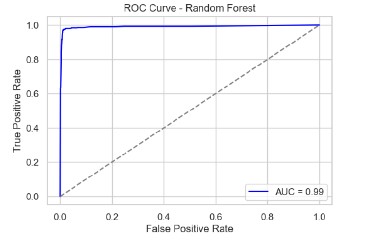

# 🧠 Employee Turnover Analysis using Machine Learning

A data science project aimed at analyzing HR data to identify key factors behind employee resignation and predict future turnover using classification models.

---

### 🎯 Business Use Case
The project aims to:
- Predict employee attrition.
- Analyze patterns among employees who left.
- Recommend actionable insights to HR based on data trends.
  
---

### 📊 Problem Statement

High employee turnover is costly and disruptive. Companies struggle to understand **why employees leave** and **how to retain them**. This project addresses:

- 🔍 What features influence employee attrition the most?
- 🔍 Can we accurately **predict which employees are likely to leave**?
- 🔍 How can data-driven strategies help **reduce turnover**?

---

## 🎯 Objective

- Perform **exploratory data analysis** (EDA) on HR data.
- Use ML classification models to **predict employee resignations**.
- Evaluate models using **accuracy, precision, recall, ROC-AUC**.
- Identify **key drivers** of employee attrition for HR strategy.

---

## 🧾 Dataset Info

- `HR_comma_sep.csv` with 14,999 rows and 10 features.
- Target variable: `left` (1 = left the company, 0 = stayed)
- Features include:
  - Satisfaction level
  - Number of projects
  - Monthly working hours
  - Time at company
  - Promotions, salary, department

---

## 📊 Exploratory Data Analysis

### ✅ 1. Correlation Heatmap

Shows feature relationships with `left`:



**Inference:**
- 🔻 `satisfaction_level`: **-0.39** correlation → lower satisfaction = more likely to leave
- 🔺 `time_spend_company`, `number_project`: higher values increase risk
- Weak influence: `promotion_last_5years`, `Work_accident`

---

### ✅ 4. Feature Distributions: Left vs Stayed


This visualization compares the distribution of key features between employees who **left** (1) and those who **stayed** (0).

**Inference:**
- **Satisfaction Level**:
  - Employees who left tend to have **low satisfaction levels**.
  - Very few high-satisfaction employees left, reinforcing its role as a strong attrition factor.
  
- **Last Evaluation**:
  - Leavers are concentrated at **very low and very high evaluation scores**.
  - High evaluation + low satisfaction may signal **burnout**.
  
- **Average Monthly Hours**:
  - Employees who left often worked either **very low or very high hours**, suggesting both **underutilization** and **overwork** contribute to exits.
  
- **Number of Projects**:
  - Those with **2 or 6–7 projects** are more likely to leave.
  - Implies that both **under-engagement** and **overload** can lead to attrition.

These patterns reinforce that **extremes in workload, satisfaction, and recognition** are risk zones for employee turnover.


---

### ✅ 3. Clustering Analysis


👥 **K-Means Clustering of Employees Who Left**

**Inference:**
- **Three clear clusters** of employees who left:
  - **Cluster 0**: Low satisfaction, low last evaluation – possibly **disengaged or neglected** employees.
  - **Cluster 1**: High satisfaction and high last evaluation – possibly **high achievers** who may have **better opportunities elsewhere** or felt **underutilized**.
  - **Cluster 2**: Very low satisfaction, but high evaluation – suggests **burnout** or **stress under pressure**.
- This clustering helps HR understand employee **behavioral patterns** and can guide **targeted retention strategies**.


## ⚙️ Model Building

### Algorithms Used:
- Logistic Regression
- Decision Tree
- Random Forest ✅ *(Best)*
- SVM
- KNN
- Gradient Boosting
- XGBoost

---

### 📈 Accuracy Comparison



- ✅ **Random Forest**: 99%
- Gradient Boosting: 96%
- Logistic Regression: 79%
- SVM: 94%
- KNN: 93%
- 
As we can see Random Forest classifier achieved high performance (F1-score = 0.98), indicating strong model accuracy across classes.

**Inference:**
- **Precision, Recall, F1-Score** for both classes (0 = Stayed, 1 = Left) are very high (**0.97–0.98**).
- This means the model performs extremely well in:
  - Correctly identifying employees who stayed.
  - Correctly predicting employees who left.
- High values in all metrics indicate **minimal misclassification** and **balanced performance**.
- The classifier (likely Random Forest) has learned important features well **without overfitting**.

---

## 📉 ROC Curve Analysis

The ROC (Receiver Operating Characteristic) curve is a graphical plot that illustrates the diagnostic ability of a binary classifier system. The Area Under Curve (AUC) value ranges from 0 to 1. The closer to 1, the better the model.

### 🔷 Random Forest
  
**AUC: 0.99** — Outstanding performance

---

## 🧠 Conclusion

- **Top contributing factors**: low satisfaction, long working hours, no promotion, many projects.
- **Random Forest** emerged as the most reliable model.
- **SMOTE** improved model performance on imbalanced data.
- HR departments can use these insights to improve employee retention through:
  - Better workload management
  - Promotion policies
  - Boosting satisfaction initiatives

---

## 🤝 Let’s Connect

💼 [LinkedIn](www.linkedin.com/in/rajguru-mathiyalagan-63b921244)  
🐙 [GitHub](https://github.com/RajguruDs/Rajguru)
📧 rajguru21.ds@gmail.com  

---

## 🔧 Run This Project

```bash
git clone https://github.com/yourusername/employee-turnover-analysis.git
cd employee-turnover-analysis
pip install -r requirements.txt
jupyter notebook
```

---

## 📁 Directory Structure

```
employee-turnover-analysis/
├── Coursendproject.ipynb
├── HR_comma_sep.csv
├── README.md
├── requirements.txt
└── images/
    ├── ROC.png
    ├── classificationreport.png
    ├── cluster.png
    ├── distribution.png
    └── heatmap.png
```
